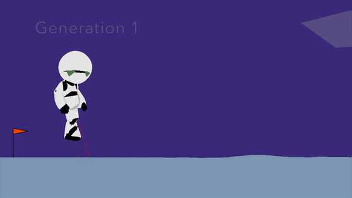

# 42 –– self-education

## Walking Marvin

### Who is Marvin?

Marvin, the Paranoid Android, is a fictional character in
The Hitchhiker's Guide to the Galaxy series by Douglas Adams.
Marvin is the ship's robot aboard the starship Heart of Gold.

### Goals

This is a python project, that uses OpenAI Gym with an environment called Marvin.
The goal is to train Marvin to walk, having the training and walking process.
The total reward for each episode after training is bigger than 100. During the
development, we learned how to use neural networks to help Marvin
get back on his feet, without using any libraries that do the goal of the
project for us, like Evostra or Tensorflow.

*To know more, see [official instructions](resources/walking-marvin.pdf).*

### Usage

**Basic form:**

To install dependencies and run the program do

```
make init
python walking_marvin
```

The program display log for each episode.

**Advanced options:**

To see a range of available options run 

```
python walking_marvin --help
```

### Example



* As training involved random initiations in each episode, the agent can get stuck in local minima. Therefore, to obtain the best possible solution, the algorithm should be run multiple times. 
* The example above was obtained using
	* single hidden layer
	* number of hidden nodes is the average of input and output layers
	*  `leaky-ReLu` with `a = -0.05` as activation
	*  `tanh` as output
	*  both weights and biases randomly initialised using He initialisation. 

### Future directions

* Keep more specimens from each population (currently keeping two), both from the top n percent and randomly selected from the rest of ranks. Breed all together to generate diversity. Current approach is iffy since if the best specimen ends up on one side of the fitness rift and the second best on the other, their child may be on the rift and slow down training.
* Especially important in the beginning as currently the most stable, crunching specimens are selected for at the expense of keeping the less stable, upright walking ones. 
* MAYBE grid optimise mutation rate, try other NN architectures (currently have one hidden layer with an average number of nodes of the input and output layers).

### Resources

The following sources helped me when working on this project:

* [OpenAI Gym documentation](https://gym.openai.com/docs)
* [Neuroevolution - Wikipedia Article](https://en.wikipedia.org/wiki/Neuroevolution)
* [Artificial Neural Network - Wikipedia Article](https://en.wikipedia.org/wiki/Artificial_neural_network)
* [How to choose the number of hidden layers and nodes in a feedforward neural network](https://stats.stackexchange.com/questions/181/how-to-choose-the-number-of-hidden-layers-and-nodes-in-a-feedforward-neural-netw)
* [What are the advantages of ReLU over the LeakyReLU (in FFNN)?](https://www.reddit.com/r/MachineLearning/comments/4znzvo/what_are_the_advantages_of_relu_over_the/)
* [Xavier and He Normal (He-et-al) Initialization](https://medium.com/@prateekvishnu/xavier-and-he-normal-he-et-al-initialization-8e3d7a087528)

###Acknowledgements 

This implementation of the project is based on an identical project by [JR Aleman](github.com/jraleman/42_Walking_Marvin). My gratitude goes to him for sharing his code online as an education resource.

## Contributors

* [A Mayorov](https://github.com/almayor/)

## License

This project is under the MIT License.
